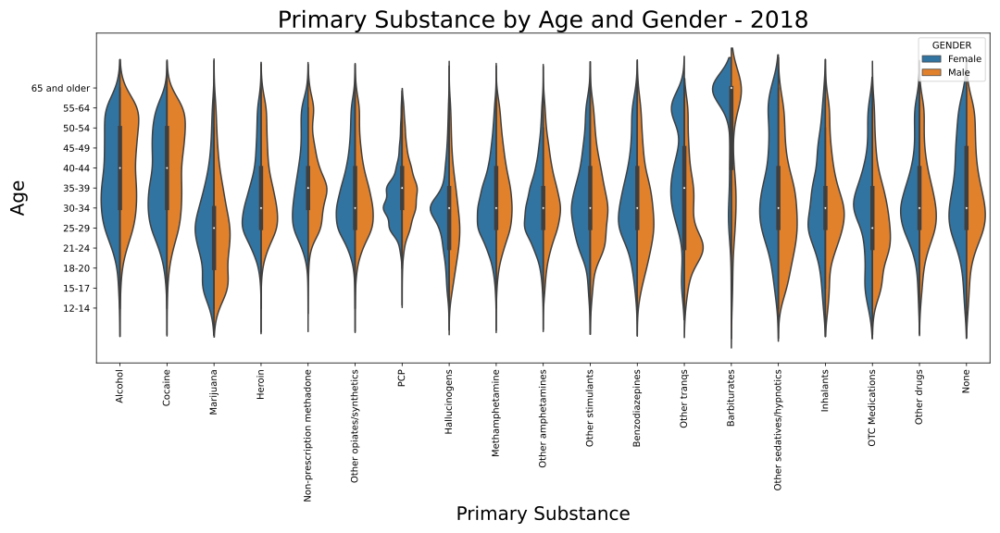
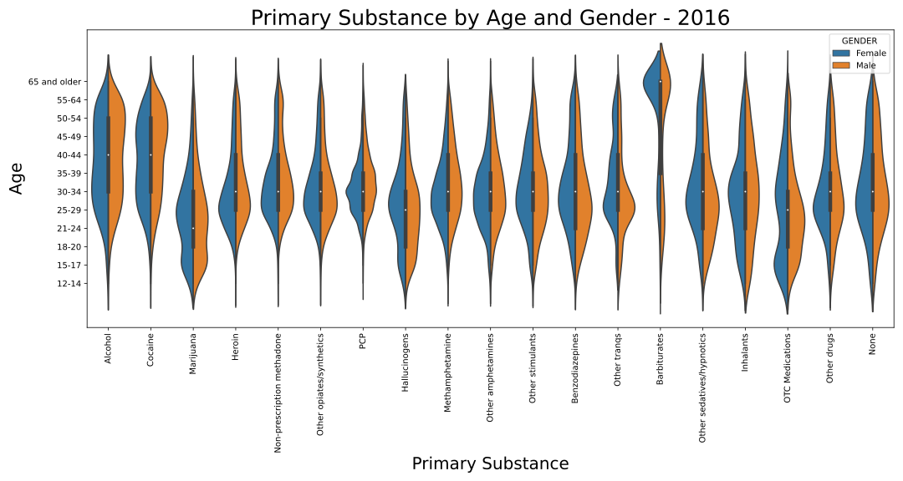

# Predicting Substance Abuse Treatment Outcomes <!-- omit in toc -->

**Team Recovery** 
Francis Ng `<chiwang@umich.edu>` 
Nicholas Dunbar `<nkdunbar@umich.edu>` 
Ricky Wong `<rckywong@umich.edu>` 
Steven Wang `<stevenzw@umich.edu>`

University of Michigan School of Information (UMSI) 
Master of Applied Data Science (MADS) 
SIADS 697 - Capstone 
Winter 2022

# Key links <!-- omit in toc -->
- [Project home](https://ricky-wong.github.io/siads697-project)
- **[Full report](https://ricky-wong.github.io/siads697-project/report)**
- [GitHub repository](https://github.com/ricky-wong/siads697-project)

# Table of Contents <!-- omit in toc -->
- [1. Introduction](#1-introduction)
  - [1.1. Background](#11-background)
  - [1.2. Motivation](#12-motivation)
    - [1.2.1. Data Source](#121-data-source)
    - [1.2.2. Literature Review](#122-literature-review)
- [2. Methodology](#2-methodology)
  - [2.1. Data Preparation](#21-data-preparation)
  - [2.2. Data Exploration](#22-data-exploration)

# 1. Introduction

## 1.1. Background

Substance abuse is a societal issue regularly in the news, but one whose prevalence throughout the country might still surprise many people. According to the National Center for Drug Abuse Statistics (2022), there have been over 700,000 drug overdose deaths in the United States since the year 2000. Nearly 32 million Americans have reported using illegal drugs within the last 30 days, a quarter of which meet substance abuse disorder criteria, and another nearly 15 million have an alcohol use disorder.

Billions in federal funding are used annually as part of the national drug control budget (Office of National Drug Control Policy, 2021). The most recent national drug control budget totaled a $41.0 billion investment in drug issues nationwide. The Substance Abuse and Mental Health Services Administration, a division of the Department of Health and Human Services, received only $6.6 billion of that FY 2022 federal budget for substance abuse prevention and treatment. While this is an increase over prior year’s funding, many programs still struggle to maintain care, and considerable cost is still passed on to the client.

Even with an increase in program funding due to the recent issues surrounding the opioid epidemic, many programs struggle to effectively fund programs while many patients find themselves requiring multiple courses of treatment before any significant sobriety can be found. To better understand the factors around substance abuse and recovery, research has recently begun to approach substance use disorders from a machine learning perspective. Some models have been able to successfully use certain data and cases with predictive accuracy, especially around physiological and behavioral measures that predict current substance use, but results are uneven due to insufficient data (Barenholtz, Fitzgerald, and Hahn, 2020). More efficient models might help researchers and clinicians to better identify the most efficient, effective treatments to focus on limited funding where it might provide the greatest benefit.

## 1.2. Motivation

One possible solution to the issue of insufficient data could be to use data collected from SAMHSA’s data division: the Substance Abuse & Mental Health Data Archive. SAMHDA is an initiative from the Center for Behavioral Health Statistics and Quality and works to provide data sets for analysis on a large scale, with information reporting from almost every state. Our project worked specifically with SAMHDA’s Treatment Episode Data Set: Discharges (TEDS-D), whose methodology will be discussed below.

### 1.2.1. Data Source

The TEDS-D dataset provided by SAMHDA provides information relating to each instance of substance abuse treatment in all reporting states, which includes variables such as demographic information, some patient substance use history, substance use at time of admission, service type at admission and discharge, and the reason for treatment discharge. These datasets are maintained by the CBHSQ, using state data submitted following the TEDS and Data Submission System user manuals available through SAMHSA.

One major consideration of the TEDS-D data is that of confidentiality protection for subjects whose information appears. Potentially identifiable information has been top or bottom coded to prevent distinguishingly high or low values, with variables recoded into categories to minimize any level of public risk. Data swapping methods are also implemented in this set to prevent potentially identifying socio-demographic characteristics.

### 1.2.2. Literature Review

Before we began our early exploratory data analysis, we wanted to examine the current body of literature specifically related to SAMHSA’s TEDS-D dataset. Our main plan with the dataset was to perform a wide range of analysis across states and across categories given the scope of the set, but most of the current literature focused on more specific aspects and variables. These studies gave us a bit more direction of where to look when selecting features and identifying potentially important variables when determining treatment efficacy and outcomes.

A few themes stood out when examining the most recent studies related to other TEDS-D datasets, particularly around 2015-2017 for most published studies. One main area of focus was that of the use of medication assisted treatment for opioid use disorders and its effects on treatment completion and retention. Medication assisted treatment utilizes medications paired with other traditional therapy modalities to provide a more holistic approach to substance abuse disorders. These medication-assisted treatments were found to have positive effects on both treatment completion and treatment retention (Stahler and Mennis, 2020; Askari, Martins, and Mauro, 2020), while other studies found that patients with other psychiatric comorbidities receiving such treatment were more at risk of treatment termination by their facility (Friesen and Kurdyak, 2020), possibly due to noncompliance issues related to other ongoing mental health issues.

Another main theme of recent literature looks at other demographic effects such as age and race. Race was found to affect treatment factors in numerous ways, such as increasing treatment retention for black and Hispanic patients with access to medication assisted treatment, even though those patients were less likely to have access to that care (Stahler, Mennis, and Baron, 2021). Other studies looked specifically at racial disparities in treatment for older adults and found that black adults were less likely than whites to complete treatment, while Hispanic patients were more likely (Suntai, Lee, and Leeper, 2020).

Given that the literature reviewed focused their studies on smaller subgroups of the overall TEDS-D data, we also expected the possibility of shifting focus to a smaller subgroup of the population. Even so, our exploratory analysis worked to examine the dataset as a whole to identify potential relationships ahead of any modeling.

# 2. Methodology

## 2.1. Data Preparation

As we began examining the TEDS-D 2019 dataset, there were many considerations and potential inconsistencies we needed to keep in mind based on how the data was originally collected and processed by SAMHDA. TEDS data tries to include any admissions to providers that receive public funding, but because each state decides their own provider’s TEDS eligibility, there is no independent check for that funding source. SAMHSA requests that any publicly funded facility submits treatment data to be collected, but some states are structured in a way that only clients treated with public funds are included in TEDS data. While TEDS data may be collected for many substance abuse treatment admissions, it does not include admissions to all programs nationwide. There is no consistent guideline for reporting from programs such as hospital-based treatment programs or correctional programs.

The TEDS codebook (2021) describes limitations to the data, and we should be aware of the limitations thereby imposed onto any of our interpretation. These limitations include the following:

- The clients and data reported in these records depend at least to some level on external factors, especially those related to program funding. Programs and states with higher funding could be able to provide treatment to a greater number of patients, including patients whose substance issues or financial situations might not qualify in less supported programs. As with any data around public health and potentially disadvantaged populations, we should be aware of potential underrepresentation of those populations without treatment access.
- Treatment and admission definitions can vary widely state-by-state, and as such admission numbers might not be well represented by the absolute number of events in each state.
There is noticeable variation in the level to which states might coerce a person into treatment when criminal justice involvement is present. Some states might refer most drug cases through drug court and into treatment programs, while others might instead focus on punishing the crime rather than treating the condition.
- Individual clients cannot be followed through the dataset, as each treatment instance is reported as a separate event without any uniquely identifying information. Some states might allow for following the progress of an individual, but TEDS is currently not able to track individual progress.
- States that do not report sufficient data are not represented in the overall set. States not included in the 2019 data were Oregon, Washington, and West Virginia.

With limitations around the dataset in mind, we were then able to look more closely into the variables and information provided. Typical demographic information such as age, race, and gender is included, with a wide range of other patient information gathered at the time of admission that reflects an individual’s substance abuse history. This history can include information about previous treatment episodes, substances used and their frequencies, and typical route of consumption for any particular substance.

One area of note was in how each of these variables was represented within the dataset. As part of their cleaning process, SAMHDA encodes each variable to numeric categories, even in the case of potentially continuous variables like age, as part of their binning to deidentify any minimum or maximum values that might otherwise allow for possible identification. Missing values for each record were all coded to the value of -9 for easy identification. Variable frequencies were reported in the codebook for the entire dataset, but this is where the differences between states in reporting started to present itself as a potential issue in analysis.

## 2.2. Data Exploration

Given the potential issues of data reported on a state-by-state basis, one of our first approaches was to break down potential variables of interest on a state level across the dataset. Our first approach was to plot the breakdowns of some variable categories across all available states. Given that we were exploring the data with the intention of identifying useful outcome variables for later modeling, one variable of note was that of a patient’s reason for discharge from that particular instance of treatment. This discharge variable could include successful completion, patient drop out, facility termination of care, transfer to another program, incarceration, death, or a general ‘Other’ category.

<!-- Begin import from '../assets/completion-rates.html' -->

<!-- End import from '../assets/completion-rates.html' -->

Looking at the discharge reason variable from this perspective was helpful in highlighting something we suspected from the start: different states were potentially reporting data in an inconsistent manner. Overall, 42.1% of cases in the TEDS-D set were reported as successful completion. Some states reported rates of treatment completion much higher than would be expected from substance abuse programs, while others reported successful completion in less than 20% of their cases. Other states appeared to have almost no dropouts, replaced by facility terminations or transfers instead.

A similar approach was used to examine the breakdown of patients’ primary substance of choice when entering treatment.

<!-- Begin import from '../assets/substance-rates.html' -->

<!-- End import from '../assets/substance-rates.html' -->

Even with the wide range of substances, we can see that the most common issues across each state typically involved alcohol, heroin, or methamphetamines. If we were to instead plot the most common substance across each state, some regional patterns emerge as well:

<!-- Begin import from '../assets/most-common-primary-substance.html' -->

<!-- End import from '../assets/most-common-primary-substance.html' -->

When we see the data from a geographical perspective, we can see areas most affected by heroin or methamphetamine, with alcohol being the most reported problem across the rest of the country. Another data issue comes up too for the states where the most commonly reported primary substance is missing, when that data should be a cornerstone of treatment planning for many programs.

Apart from differences across the states, we also wanted to plot relationships and distribution of other potential variables of interest more generally. One option for looking at relationships across a majority of the dataset was to utilize a dendrogram and heatmap through the use of Seaborn’s clustermap(). Some identifiable clusters and relationships became apparent through this plot:

For a little more focused examination of some variables of interest, we also wanted to look at the potential patterns related to patient age, gender, and primary substance.

While many of the substances tend to stay towards the middle of the overall population, we can see that marijuana use tends to skew younger, while barbiturate use skews much older. More subtle differences by gender also appear across each substance.
